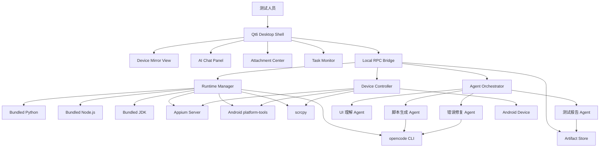
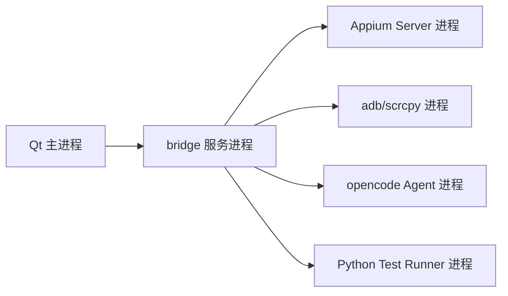
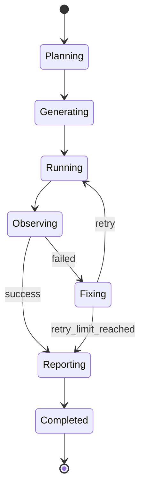
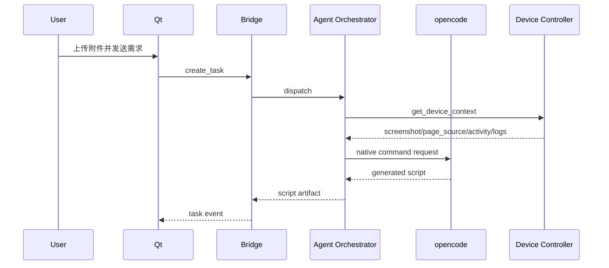
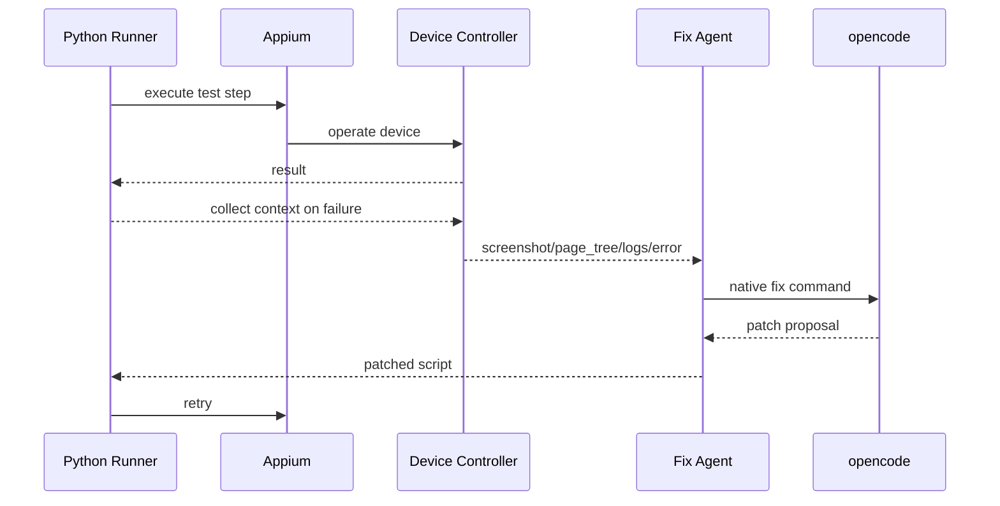

# 系统架构

## 1. 架构目标

系统采用桌面宿主、自动化运行时、设备观测、Agent 编排和插件扩展分层架构。核心目标是让 Qt6 前端负责稳定交互和可视化，让 Python + Appium 负责设备自动化，让 opencode 负责 Agent 原生代码生成和修复，让报告与附件模块负责测试资产闭环。

## 2. 总体架构



## 3. 进程模型



建议进程职责：

- Qt 主进程：UI、状态展示、用户输入、画面渲染。
- bridge 服务进程：本地 API、任务队列、事件总线、跨语言通信。
- Appium Server 进程：移动端自动化会话。
- adb/scrcpy 进程：设备发现、画面流、日志、截图。
- opencode Agent 进程：脚本生成、修复、报告内容生成。
- Python Test Runner 进程：执行测试脚本并回传事件。

Qt 主进程不直接执行长耗时测试任务，避免 UI 卡死。

## 4. 模块划分

### 4.1 Qt Desktop Shell

职责：

- 主窗口布局。
- 手机实时画面展示。
- 对话框与附件区。
- 测试进度展示。
- 报告预览。
- 用户配置管理。

建议 Qt 模块：

- `ui/main_window`
- `ui/device_panel`
- `ui/chat_panel`
- `ui/attachment_panel`
- `ui/task_panel`
- `ui/report_viewer`
- `core/local_api_client`
- `core/event_stream_client`

### 4.2 Local RPC Bridge

职责：

- 向 Qt 提供本地 HTTP/WebSocket 或 QLocalSocket API。
- 管理任务生命周期。
- 统一启动和停止 Python、Appium、ADB、scrcpy、opencode。
- 归一化日志、截图、页面树和测试结果。

建议使用 Python 实现 bridge，便于复用 Appium、文档解析和报告生成生态。

### 4.3 Runtime Manager

职责：

- 检查内置运行时是否存在。
- 生成隔离环境变量。
- 为每个任务创建工作目录。
- 分配端口。
- 启动 Appium Server。
- 启动 opencode CLI。
- 检查 Android platform-tools、scrcpy、JDK、Node.js、Python。

运行时路径不写入系统 PATH，只注入子进程环境。

### 4.4 Device Controller

职责：

- 设备发现。
- 设备连接状态维护。
- ADB 命令封装。
- Appium Session 管理。
- 截图、录屏、页面树、日志采集。
- Toast、Crash、ANR 检测。
- 当前 Activity 和 Fragment 采集。

### 4.5 Agent Orchestrator

职责：

- 解析用户消息。
- 加载附件上下文。
- 选择合适 Agent。
- 维护 Agent 状态机。
- 限制修复重试次数。
- 将设备观测结果传给 Agent。
- 将 Agent 产物写入任务目录。

Agent 状态机：



### 4.6 Artifact Store

职责：

- 保存附件解析结果。
- 保存生成脚本。
- 保存截图、页面树、日志。
- 保存执行记录。
- 保存 Markdown 报告。
- 保存回填后的附件文件。

建议目录：

```text
workspace/
  tasks/
    20260710-230000-bt-connect/
      input/
      parsed/
      scripts/
      runs/
      screenshots/
      logs/
      reports/
      filled/
```

## 5. 数据流

### 5.1 脚本生成数据流



### 5.2 执行与修复数据流



## 6. 关键接口草案

### 6.1 Qt 调用 Bridge

```http
POST /api/tasks
Content-Type: application/json

{
  "message": "根据附件生成蓝牙连接测试脚本",
  "attachments": ["input/cases.xlsx"],
  "deviceId": "emulator-5554",
  "appPackage": "com.ss.android.ugc.aweme.lite"
}
```

### 6.2 Bridge 事件流

```json
{
  "taskId": "20260710-230000-bt-connect",
  "type": "agent.script.generated",
  "message": "脚本生成完成",
  "artifact": "scripts/test_bt_connect.py"
}
```

### 6.3 设备上下文

```json
{
  "deviceId": "R5CT0000000",
  "platform": "Android",
  "androidVersion": "14",
  "screen": {"width": 1080, "height": 2400},
  "app": {
    "package": "com.example.doubao",
    "activity": ".MainActivity",
    "fragment": "DeviceConnectFragment"
  },
  "observability": {
    "screenshot": "screenshots/current.png",
    "pageSource": "runs/current_page.xml",
    "logcat": "logs/logcat.txt",
    "crash": null,
    "anr": null,
    "toast": "连接成功"
  }
}
```

## 7. opencode 集成原则

- 所有 Agent 代码生成、修改和解释行为通过 opencode 原生命令完成。
- 系统只封装命令执行、工作目录、输入输出、超时和日志，不重写 opencode 的语义。
- opencode 调用必须记录完整上下文摘要、命令、退出码和产物路径。
- 禁止把用户隐私、账号、Token、公司敏感日志明文写入长期上下文。
- 对命令输出做结构化归档，便于复盘每次脚本生成和修复过程。

## 8. 异常处理

| 异常 | 处理策略 |
| --- | --- |
| 手机断开 | 暂停任务，提示用户重新连接，保留任务上下文 |
| Appium Session 失效 | 重建 Session，最多重试 2 次 |
| 控件找不到 | 采集截图和页面树，交给 UI 理解 Agent |
| App 崩溃 | 抓取 logcat、tombstone、截图，标记为阻塞失败 |
| ANR | 抓取 traces 和当前页面状态，报告中高亮 |
| opencode 失败 | 记录退出码和 stderr，允许用户手动查看 |
| 附件解析失败 | 保留原文件，提示不支持部分内容 |

## 9. 安全边界

- 默认只操作用户选择的设备。
- 默认只读取用户上传附件和当前任务目录。
- 日志脱敏后再传给 Agent。
- 删除任务产物前需要用户确认。
- 企业内网环境下支持离线运行和本地模型适配预留。

