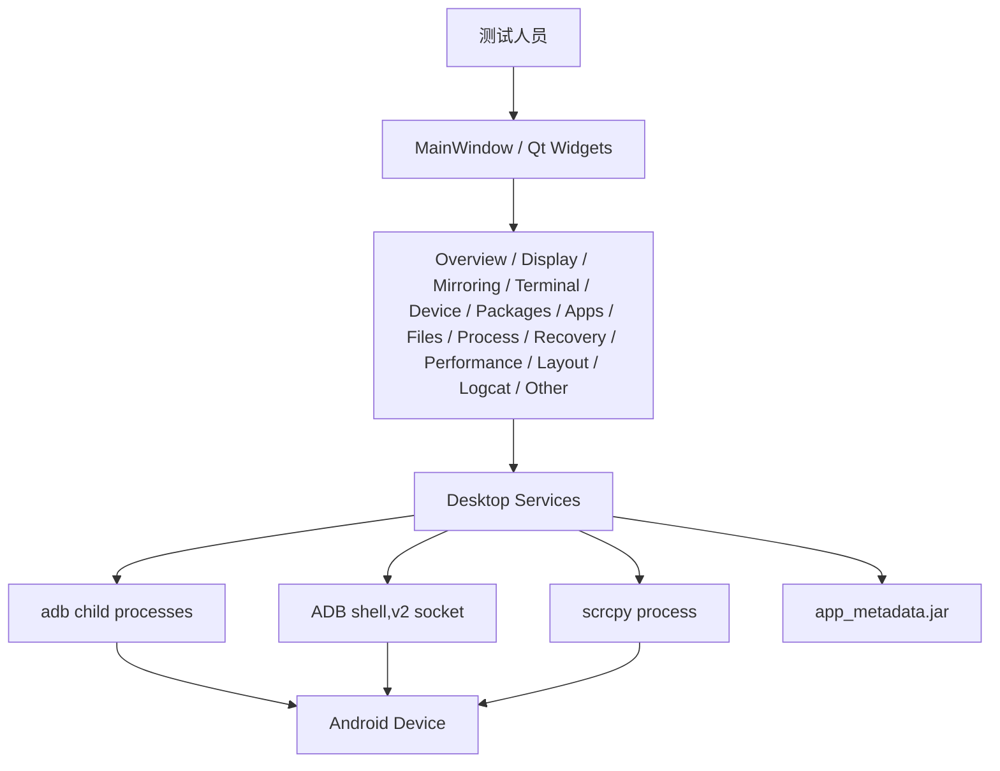
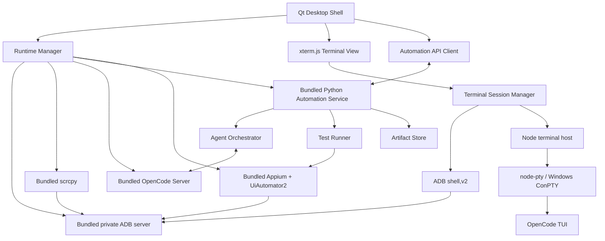
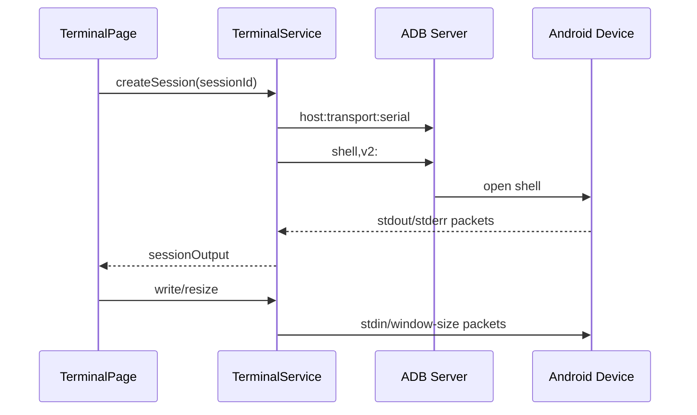
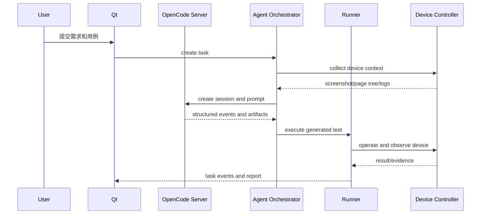

# 系统架构

## 1. 文档范围

本文同时描述当前可运行架构和目标产品架构。OpenCode TUI 会话接入已进入进行中阶段；规划中的 Python、Appium、OpenCode Server/SDK 能力不会被描述为已经完成。

## 2. 架构原则

- Qt 主线程只负责交互和轻量状态合成，设备采样、文件传输和外部进程必须异步。
- UI 页面不直接拼接外部命令；命令和协议集中在 service 或 runtime 层。
- 发布版本只使用随包运行时和绝对路径，不依赖系统 `PATH`。
- ADB、OpenCode Server、Appium 等本机服务使用应用分配的端口和进程级环境，避免影响用户已有工具。
- 终端显示与会话后端分离，设备 shell 和 OpenCode TUI 复用统一终端界面。
- Agent 决策通过结构化协议进入自动化层，不通过解析终端屏幕驱动产品状态。
- 用户任务、缓存和凭据与只读安装目录分离。

## 3. 当前架构



当前桌面 services：

| Service | 当前职责 |
| --- | --- |
| `ScrcpyService` | ADB 设备轮询、主屏幕/虚拟屏幕/摄像头镜像、录制和错误处理 |
| `DisplayService` | 分辨率、密度、超时、刷新率、主题、字体和动画设置的异步读写 |
| `TerminalService` | ADB transport、`shell,v2`/legacy、多终端会话和 resize |
| `AdbControlService` | Android KEYCODE、电源和系统快捷操作 |
| `PackageManagerService` | 软件包查询、详情、安装、卸载、启停用和清数据 |
| `AppsService` | 应用列表、元数据、启动停止、权限、后台模式、APK 导入导出和按设备隔离的本次运行缓存 |
| `FileManagerService` | 目录浏览、上传下载、重命名、复制、权限、删除和按设备隔离的目录缓存 |
| `RecoveryService` | Recovery sideload 和进度输出 |
| `PerformanceService` | CPU、内存、电池、温度和前台应用 FPS 采样 |
| `ProcessService` | 软件包缓存、`top` 进程采样、启动快照预取和应用强制停止 |
| `OtherService` | 自定义 Shell 与系统设置工具命令的异步执行和结果回传 |
| `TerminalService` | 统一管理 ADB shell 与 OpenCode 会话，设备切换只回收 ADB 会话 |
| `ConPtySession` | 通过随包 Node.js/`node-pty` 宿主创建 OpenCode ConPTY |

当前 Python `services/automation/`、contracts 和 tests 主要是目录骨架，尚未形成运行进程。仓库中的 `plugins/`、`skills/` 是早期空目录，不属于目标架构，后续可以清理。

## 4. 目标架构



## 5. 目标进程模型

| 进程 | 所有者 | 说明 |
| --- | --- | --- |
| Qt 主进程 | 桌面端 | 页面、状态、轻量协议和子进程监督入口 |
| Qt WebEngine 进程 | Qt 部署 | xterm.js 显示；仅加载随包本地资源 |
| 私有 ADB server | Runtime Manager | 使用应用端口，不终止系统默认 server |
| scrcpy | Runtime Manager | 镜像窗口或未来视频流 |
| Node terminal host | `ConPtySession` | 帧协议、`node-pty` 与 ConPTY 生命周期 |
| OpenCode TUI | node-pty / ConPTY | 面向用户的完整 AI 终端交互 |
| OpenCode Server | Runtime Manager | OpenAPI/SDK、会话、权限和结构化事件 |
| Python Automation Service | Runtime Manager | 本地 API、Agent 编排、附件和报告 |
| Appium Server | Automation Service | Android 自动化会话 |
| Python Test Runner | Automation Service | 隔离执行测试脚本和采集产物 |

Qt 主进程退出时，Runtime Manager 必须按所有权只回收本应用启动的进程。

## 6. 模块边界

### 6.1 Desktop UI

- `ui/windows/`：顶层窗口和页面装配。
- `ui/pages/`：主工作区页面。
- `ui/widgets/`：曲线、终端宿主等复用控件。
- `ui/components/`：Header、Sidebar、Toolbar 等窗口区域。
- `ui/styles/`：应用 QSS。

页面只能通过 signals/slots 或 client 接口请求业务动作。

### 6.2 Desktop Services

当前负责具体 ADB 和 scrcpy 操作。后续应进一步抽取：

- `RuntimeLocator`：按 manifest 解析组件绝对路径。
- `RuntimeManager`：端口、环境、自检和进程生命周期。
- `TerminalSessionManager`：管理 ADB、ConPTY 等后端。
- `AutomationClient`：连接 Python 本地服务。

### 6.3 Automation Service（规划中）

- `api/`：本地 HTTP/WebSocket 或 QLocalSocket 接口。
- `agents/`：脚本生成、UI 理解、错误修复和报告 Agent。
- `device/`：Appium、ADB 观测和设备事实。
- `runner/`：执行、超时、取消和重试。
- `attachments/`：用例解析和结果回填。
- `reports/`：Markdown、Excel、Word 等结果输出。
- `runtime/`：Python 侧组件健康检查和子进程适配。

### 6.4 OpenCode

- TUI 由 `node-pty` 放入 ConPTY，并在完整 WebEngine 构建中显示于 xterm.js；基础构建使用降级显示。
- Server/SDK 提供结构化会话和事件。
- Agent Orchestrator 不解析 TUI 文字。
- 工作目录绑定到用户选择的测试项目或任务目录。
- plugins、skills、agents 和 tools 直接使用 OpenCode 官方机制；宿主不实现重复的发现、安装、Schema 或运行器。
- 宿主只管理随包 OpenCode 版本、启动环境、权限展示、Server/SDK 连接和任务产物边界。

### 6.5 Artifact Store（规划中）

```text
workspace/
  tasks/
    <task-id>/
      input/
      parsed/
      scripts/
      runs/
      screenshots/
      logs/
      reports/
      filled/
      task.json
```

任务目录必须可单独归档、诊断和删除。

## 7. 核心数据流

### 7.1 当前设备终端



### 7.2 当前启动预热与会话缓存

主窗口进入事件循环后立即让 Appium Inspector 页面保持 active 并完成一次前端布局，同时创建一个默认 OpenCode 会话，在隐藏终端中继续消费初始输出。检测到授权设备后，`MainWindow` 异步触发以下任务：

- `AppsService` 读取应用列表，并继续分批提取名称和 PNG 图标。
- `ProcessService` 读取软件包和一次 `top` 快照；进程页可见后恢复 8 秒采样。
- `FileManagerService` 预取 `/` 与 `/sdcard`，不递归遍历子目录。

应用、进程和目录缓存以设备序列号为键，只在当前桌面进程内保存。断开后重连同一设备可立即恢复缓存，切换设备不会复用上一台设备数据。手动刷新绕过目录缓存；上传、重命名、复制、权限和删除等变更会使目录缓存失效。设备切换时先终止旧 `QProcess` 并抑制其完成回调，避免旧结果写入新设备缓存。

桌面 UI 图标统一保存在 `resources/images/icons/`，由 CMake 在链接和安装阶段复制到可执行文件旁的 `runtime/images/icons/`。界面通过 `ui::imageResourcePath()`、`ui::imageIcon()` 和 `ui::imagePixmap()` 按相对路径加载，不依赖开发机绝对路径或字符字体图标。

### 7.3 目标 AI 自动化



## 8. 运行时隔离

运行时设计以 [PORTABLE_RUNTIME.md](PORTABLE_RUNTIME.md) 为准：

- 发布包自带工具，终端用户不安装或下载依赖。
- 构建阶段锁定版本、来源和 SHA-256。
- 子进程不读取系统同名工具。
- 私有服务绑定 loopback 和应用端口。
- 安装目录只读，用户数据进入 `QStandardPaths` 对应位置。

## 9. 错误模型

错误需要包含稳定 code、用户消息、技术详情和恢复建议：

```json
{
  "code": "RUNTIME_COMPONENT_CORRUPT",
  "message": "内置 ADB 文件校验失败",
  "detail": "sha256 mismatch: runtime/windows-x64/android/platform-tools/adb.exe",
  "recoverable": false,
  "action": "repair_installation"
}
```

禁止只显示原始 stderr。原始输出进入诊断日志，UI 展示可操作摘要。

## 10. 安全边界

- 默认只操作用户选中的设备和 workspace。
- 重启、卸载、清数据、删除文件等动作需要按风险确认。
- OpenCode 和 Agent 读取范围、网络权限和命令权限必须可配置。
- 日志和报告落盘前脱敏。
- 凭据不进入命令行、普通日志或任务产物。
- 本机 HTTP 服务默认只监听 `127.0.0.1` 并使用随机认证信息。

## 11. 相关文档

- [终端与 OpenCode 架构](TERMINAL_ARCHITECTURE.md)
- [便携运行时规范](PORTABLE_RUNTIME.md)
- [项目结构](PROJECT_STRUCTURE.md)
- [开发路线图](ROADMAP.md)
