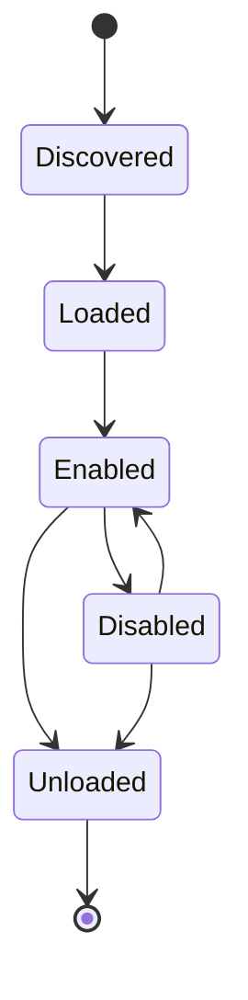

# 插件开发规范

## 1. 插件目标

插件用于扩展 AI Mobile Test Studio 的设备能力、附件解析能力、测试领域能力、报告导出能力和第三方系统对接能力。插件应做到可独立安装、可禁用、可升级，不影响核心应用稳定性。

## 2. 插件类型

| 类型 | 用途 | 示例 |
| --- | --- | --- |
| `device` | 扩展设备能力 | 新增蓝牙调试工具、厂商设备信息采集 |
| `attachment_parser` | 扩展附件解析 | 解析公司自定义 Excel 模板 |
| `report_exporter` | 扩展报告导出 | 导出 Feishu、Word、Excel、禅道 |
| `agent_tool` | 扩展 Agent 可调用工具 | 蓝牙扫描分析、页面树 diff |
| `test_template` | 扩展测试模板 | 豆包眼镜连接测试模板 |
| `runtime` | 扩展外部工具链 | 新增抓包工具、性能采集工具 |

## 3. 插件目录结构

```text
plugins/
  doubao_glasses_connect/
    plugin.json
    README.md
    python/
      doubao_glasses_connect/
        __init__.py
        parser.py
        tools.py
        report.py
    resources/
      templates/
      prompts/
      icons/
    tests/
```

## 4. 插件清单

每个插件必须包含 `plugin.json`。

```json
{
  "id": "doubao_glasses_connect",
  "name": "豆包眼镜连接测试插件",
  "version": "0.1.0",
  "description": "提供豆包 App 与眼镜连接测试模板、用例解析和报告回填能力。",
  "author": "AI Mobile Test Studio",
  "entry": {
    "python": "python/doubao_glasses_connect"
  },
  "capabilities": [
    "attachment_parser",
    "agent_tool",
    "test_template",
    "report_exporter"
  ],
  "permissions": {
    "device": true,
    "network": false,
    "filesystem": ["workspace/tasks"],
    "commands": []
  },
  "compatibleWith": {
    "app": ">=0.1.0",
    "pluginApi": "1"
  }
}
```

## 5. 插件生命周期



生命周期钩子：

- `on_discover`
- `on_load`
- `on_enable`
- `on_disable`
- `on_unload`

钩子失败不得导致主程序崩溃。

## 6. Python 插件接口

插件入口应提供 `register` 函数。

```python
from studio_sdk import PluginRegistry

def register(registry: PluginRegistry) -> None:
    registry.add_attachment_parser(DoubaoCaseParser())
    registry.add_agent_tool(BluetoothDiagnosticTool())
    registry.add_report_exporter(DoubaoExcelBackfillExporter())
```

## 7. 附件解析插件

附件解析器接口：

```python
class AttachmentParser:
    id: str
    supported_extensions: list[str]

    def parse(self, file_path: str, task_dir: str) -> dict:
        ...
```

返回结构：

```json
{
  "type": "test_cases",
  "source": "cases.xlsx",
  "cases": [
    {
      "caseId": "BT-001",
      "title": "眼镜蓝牙连接成功",
      "preconditions": ["手机蓝牙开启", "眼镜处于可配对状态"],
      "steps": ["打开豆包 App", "进入设备连接页", "选择眼镜设备"],
      "expected": "页面显示已连接",
      "priority": "P0"
    }
  ]
}
```

## 8. Agent Tool 插件

Agent Tool 是允许 Agent 调用的受控能力。每个工具必须声明输入、输出和权限。

```json
{
  "id": "bluetooth_scan_summary",
  "name": "蓝牙扫描摘要",
  "description": "读取设备日志并汇总扫描到的蓝牙设备。",
  "inputSchema": {
    "type": "object",
    "properties": {
      "logPath": {"type": "string"}
    },
    "required": ["logPath"]
  },
  "outputSchema": {
    "type": "object",
    "properties": {
      "devices": {"type": "array"},
      "warnings": {"type": "array"}
    }
  }
}
```

## 9. 报告导出插件

报告导出器负责将 Markdown 报告或结构化结果输出到指定格式。

```python
class ReportExporter:
    id: str
    output_extensions: list[str]

    def export(self, report: dict, output_path: str) -> str:
        ...
```

典型导出：

- Markdown。
- Excel 回填。
- Word 回填。
- HTML。
- PDF。

## 10. 权限模型

插件默认无权限。必须在 `plugin.json` 中声明所需权限。

权限类型：

- `device`
- `network`
- `filesystem`
- `commands`
- `agent_context`

高风险权限需要 UI 提示：

- 执行外部命令。
- 访问任务目录外文件。
- 网络上传。
- 读取未脱敏日志。

## 11. 版本兼容

插件 API 使用整数版本号。破坏性变更必须提升 `pluginApi` 主版本。

兼容声明：

```json
{
  "compatibleWith": {
    "app": ">=0.1.0 <1.0.0",
    "pluginApi": "1"
  }
}
```

## 12. 插件测试要求

每个插件至少提供：

- 清单校验测试。
- 插件加载测试。
- 核心能力单元测试。
- 错误输入测试。

设备类插件如需真机，应提供可跳过的集成测试。

