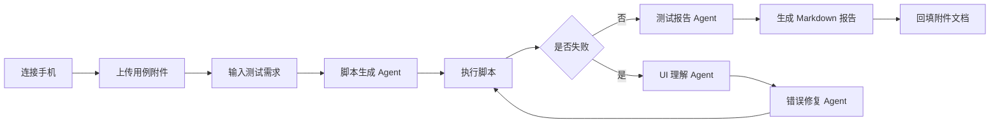

# AI Mobile Test Studio 项目设计

## 1. 项目定位

AI Mobile Test Studio 是一款面向移动端连接测试的桌面自动化测试应用。第一阶段重点服务于眼镜与手机端豆包 App 的连接测试场景，包括蓝牙功能测试、蓝牙性能测试、Wi-Fi 功能测试、异常恢复测试和测试报告自动生成。

产品目标是让测试人员在不手动安装 Python、Appium、JDK、Node.js、npm、scrcpy、opencode 等复杂依赖的情况下，直接连接手机、上传测试用例、提出测试需求，并由 AI Agent 自动生成、执行、修复和汇总测试结果。

## 2. 目标用户

- 移动端测试实习生、测试工程师、外包测试人员。
- 需要频繁执行手机 App 自动化、蓝牙连接、Wi-Fi 连接、眼镜配对流程的测试人员。
- 不希望维护复杂本地环境，但需要稳定产出测试脚本、日志、截图和报告的项目成员。

## 3. 核心场景

### 3.1 眼镜与手机 App 连接测试

典型测试链路：

1. 连接 Android 手机。
2. 启动豆包 App。
3. 打开眼镜连接入口。
4. 扫描或选择待测眼镜设备。
5. 执行蓝牙连接、断开、重连、弱网、后台切前台、熄屏恢复等流程。
6. 采集连接耗时、成功率、失败日志、截图、Toast、Crash、ANR、当前 Activity、Fragment、页面树和控件信息。
7. 生成测试报告并回填测试用例附件。

### 3.2 用例附件驱动测试

用户可以上传以下格式作为测试输入：

- 表格：`xlsx`、`csv`
- 文档：`pdf`、`docx`、`txt`、`md`
- 日志：`log`、`json`、`xml`

系统解析附件后，抽取测试点、前置条件、步骤、期望结果、优先级和备注，供脚本生成 Agent 使用。

### 3.3 对话驱动测试

右侧对话区类似豆包桌面端体验。用户可以通过自然语言提出需求，例如：

- “根据这个 Excel 用例表生成蓝牙连接自动化脚本。”
- “这次重点测连接耗时，记录每次从点击连接到显示已连接的时间。”
- “失败后帮我截图、抓日志，并判断是控件没找到还是 App 崩溃。”
- “把结果回填到我上传的用例表里。”

AI Agent 收到需求后，不直接凭空生成最终脚本，而是进入“生成、观察、执行、修复、报告”的闭环。

## 4. 产品形态

### 4.1 主界面布局

主窗口采用左右分栏：

- 左侧：实时手机画面与设备控制区。
- 右侧：AI 对话、附件、Agent 状态、测试进度和结果入口。

左侧能力：

- 实时显示手机画面。
- 支持点击、滑动、输入、返回、Home、截图。
- 显示设备在线状态、电量、分辨率、Android 版本、App 包名、当前 Activity。
- 可切换页面树、控件属性、日志流、截图历史。

右侧能力：

- 对话输入。
- 附件上传。
- Agent 执行计划展示。
- 脚本生成过程展示。
- 错误修复建议展示。
- 报告和回填文件下载入口。

### 4.2 用户工作流

## 5. Agent 设计

系统至少包含四类核心 Agent。

### 5.1 脚本生成 Agent

职责：

- 读取用户需求和附件用例。
- 基于 Python + Appium 生成测试脚本。
- 尽量使用稳定定位方式，如 resource-id、accessibility id、text、XPath 组合。
- 生成可执行的测试任务目录，包括脚本、配置、依赖声明和运行说明。
- 使用 opencode 原生命令完成代码生成、修改和上下文协作。

输入：

- 用户消息。
- 附件解析结果。
- 当前设备信息。
- App 包名、Activity、页面树、截图。

输出：

- Python 测试脚本。
- 测试计划。
- 需要执行的设备操作。
- 对环境或权限的要求。

### 5.2 UI 理解 Agent

职责：

- 获取手机截图。
- 获取当前 Activity、Fragment、页面 XML 树、控件属性。
- 识别当前页面状态和用户所在流程。
- 判断脚本失败原因是否与页面跳转、控件不可见、弹窗、权限框、Toast、弱网、蓝牙状态有关。

输入：

- 截图。
- Appium page source。
- ADB dumpsys 信息。
- 日志、Toast、Crash、ANR 信息。

输出：

- 当前页面语义描述。
- 可交互控件列表。
- 页面状态判断。
- 下一步建议操作。

### 5.3 错误修复 Agent

职责：

- 分析失败日志、异常栈、截图和页面树。
- 判断失败类型。
- 修改测试脚本或测试数据。
- 触发重试。
- 记录每次修复原因，避免无限循环。

典型失败类型：

- 控件定位失败。
- 页面未加载完成。
- App 卡顿或崩溃。
- 蓝牙设备未扫描到。
- Wi-Fi 状态不满足前置条件。
- 权限弹窗阻塞流程。
- Appium Session 失效。

### 5.4 测试报告 Agent

职责：

- 汇总执行结果。
- 自动生成 Markdown 报告。
- 输出成功率、失败原因、截图、日志、耗时、建议。
- 将结果回填到用户上传的附件文档。

报告内容：

- 测试概览。
- 环境信息。
- 用例执行明细。
- 成功率统计。
- 失败原因归类。
- 关键截图。
- 关键日志。
- 性能指标。
- 后续建议。

## 6. 自动化能力边界

第一阶段支持 Android 设备。iOS 设备暂不作为首要目标。

优先支持：

- ADB 设备发现。
- Appium Android 自动化。
- scrcpy 或自研流式画面显示。
- 当前 Activity 采集。
- Appium page source 采集。
- logcat 采集。
- Toast、Crash、ANR 识别。
- 截图与录屏。
- 附件解析与报告回填。

暂不优先支持：

- 真机云管理。
- 多设备并发压力调度。
- iOS 自动化。
- 复杂硬件仪器联动。

## 7. 免安装打包策略

应用应采用“宿主程序 + 内置运行时 + 插件化工具链”的方式分发。

内置内容：

- Qt6 桌面应用。
- Python 便携运行时。
- Node.js 便携运行时。
- Appium Server 与 Android driver。
- JDK 运行时。
- Android platform-tools。
- scrcpy。
- opencode CLI。
- 默认 Python 依赖包。

启动时由 Runtime Manager 负责检查工具链完整性，并将内置路径注入进程环境变量，避免污染用户系统环境。

## 8. 成功标准

MVP 阶段成功标准：

- 用户解压或安装后即可打开应用。
- 插入 Android 手机后能识别设备并显示实时画面。
- 能上传 Excel 或 Markdown 用例。
- 能通过对话生成 Appium 脚本。
- 能执行脚本并采集截图、日志和页面树。
- 失败后能进行至少一次自动修复。
- 测试结束后能生成 Markdown 报告。

正式版成功标准：

- 常见测试任务无需用户手写代码。
- 蓝牙连接流程可稳定自动化。
- 报告可直接用于提交。
- 依赖环境无需用户手动安装。
- 插件和 Agent 能独立升级。

