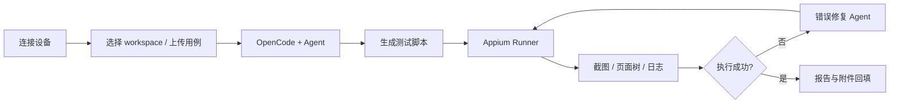

# AI Mobile Test Studio 项目设计

## 1. 产品定位

AI Mobile Test Studio 是面向 Android 设备调试与 AI 自动化测试的 Windows 桌面应用。产品从可靠的设备工具工作台起步，逐步形成“设备观测、用例输入、AI 生成、自动执行、失败修复、证据归档、报告输出”的闭环。

最终用户不应为了运行产品而安装或下载 Qt、ADB、scrcpy、OpenCode、Python、Node.js、JDK、Appium 等工程依赖。完整发布包必须携带锁定版本的运行时；用户只负责设备授权、项目选择和必要的模型账号配置。

## 2. 当前产品能力

当前主程序是 Qt 6 Widgets 桌面应用，已经具备：

- **终端**：ADB `shell,v2` 持久会话、多标签、快捷命令、输入输出和 resize。
- **OpenCode 终端接入**：可从新建菜单创建独立 OpenCode 会话，通过 `node-pty`/ConPTY 运行；xterm.js 在完整 WebEngine 构建中启用。
- **设备控制**：Android KEYCODE、电源、显示、媒体、系统应用等操作。
- **软件包管理器**：包列表、详情、安装、卸载、启停用和清数据。
- **应用**：应用分类、详情、图标、启动停止、权限、后台模式、APK 安装与导出。
- **Files**：设备文件浏览、上传下载、重命名、复制、权限和删除。
- **Recovery**：sideload 文件选择、执行、取消和进度。
- **性能**：CPU、核心频率、内存、电池、温度和前台应用 FPS。
- **镜像**：通过 scrcpy 独立进程启动和停止设备镜像。

当前限制：OpenCode、Node.js 和 `node-pty` 已形成锁定的 Windows x64 开发构建 runtime，并通过真实 OpenCode ConPTY 启动冒烟；scrcpy/ADB 和其余依赖尚未进入统一锁文件。交互式 OpenCode + xterm.js 端到端验收、OpenCode Server/SDK、Appium、Python 服务、附件解析、报告和完整安装包尚未完成。

## 3. 目标用户

- 移动端测试工程师和测试实习生。
- 需要频繁执行蓝牙、Wi-Fi、眼镜配对和异常恢复流程的团队。
- 希望保留 AI 终端可见性，同时需要结构化自动化结果的高级用户。
- 不愿维护复杂本地工具链的非开发用户。

## 4. 核心场景

### 4.1 设备诊断

1. 连接 Android 设备并完成 USB 调试授权。
2. 使用终端、设备控制、应用、包、文件和性能页面定位问题。
3. 启动镜像观察实际交互。
4. 导出日志、截图、APK 或诊断包。

### 4.2 AI 辅助自动化测试（目标）

1. 选择测试 workspace 和 Android 设备。
2. 上传 Excel、Markdown、Word、PDF 或日志附件。
3. 通过产品界面或内嵌 OpenCode TUI 提交测试目标。
4. OpenCode Server/SDK 返回结构化会话和 Agent 事件。
5. Agent 结合设备截图、页面树、Activity 和日志生成 Appium 脚本。
6. Runner 执行脚本，失败时采集证据并有限重试。
7. 生成 Markdown 报告并按格式回填用例附件。

## 5. 终端产品设计

终端页最终同时承载：

- Android 设备 shell。
- OpenCode AI TUI。
- 可选本地 PowerShell/诊断会话。

不同后端共享标签、复制粘贴、主题和快捷键。显示组件在 Qt WebEngine 可用时采用 xterm.js，降级构建使用基础显示；Android 后端保留 ADB `shell,v2`，OpenCode 后端由 `node-pty` 创建 Windows ConPTY。搜索和更多 xterm addons 仍待实现。

OpenCode TUI 用于用户观察和干预，产品状态使用 OpenCode Server/SDK，不解析终端文字。详细设计见 [TERMINAL_ARCHITECTURE.md](TERMINAL_ARCHITECTURE.md)。

## 6. Agent 设计（规划中）

### 6.1 脚本生成 Agent

- 读取用户需求、统一用例 JSON 和设备上下文。
- 生成可执行的 Python + Appium 脚本。
- 写入任务目录并给出前置条件和风险。

### 6.2 UI 理解 Agent

- 分析截图、page source、Activity、弹窗、Toast、Crash 和 ANR。
- 输出页面语义、可交互控件和下一步建议。

### 6.3 错误修复 Agent

- 根据失败日志和证据修改定位、等待或测试数据。
- 每次修复有原因和差异；默认最多自动重试 2 次。

### 6.4 报告 Agent

- 汇总环境、步骤、成功率、失败原因、耗时、截图和日志。
- 生成 Markdown，并把结构化结果交给附件回填模块。

## 7. 自动化能力边界

首个正式版本优先：

- Windows x64 宿主。
- Android 真机和常用 ADB 状态。
- Appium UiAutomator2。
- 单设备任务闭环。
- 蓝牙、Wi-Fi、眼镜配对和 App 生命周期测试。

暂不优先：

- iOS 自动化。
- 真机云和大规模并发。
- 复杂硬件仪器联动。
- 完全离线的大模型分发。

## 8. 分发体验

目标交付两种完整制品：

- 签名安装包。
- 包含同等运行时的便携 ZIP。

两者都不得在首次启动时下载工程工具。依赖版本、校验、路径隔离和许可要求见 [PORTABLE_RUNTIME.md](PORTABLE_RUNTIME.md)。

用户仍可能需要：

- 完成 Android USB 调试授权。
- 安装特定设备的 OEM USB 驱动。
- 配置自己的模型服务凭据并允许必要网络访问。

## 9. 安全与可解释性

- 所有高风险设备命令明确确认。
- Agent 每次文件修改、命令执行和设备操作可追踪。
- 凭据不写入普通日志或任务目录。
- OpenCode 只绑定本机并使用认证。
- 每个测试结果必须带证据路径，不能只给自然语言结论。

## 10. 成功标准

### 10.1 设备工具 MVP

- 主程序稳定启动并识别真机。
- 终端、设备控制、应用、包、文件、Recovery 和性能工作区可用。
- 设备断开和错误不会阻塞 UI。

当前状态：大部分已实现，便携依赖装配尚未完成。

### 10.2 便携发布版

- 干净 Windows 电脑无需安装或下载工具即可启动全部本地能力。
- 不修改永久 PATH，不与系统 ADB/OpenCode 冲突。
- 所有随包组件有版本、SHA-256、来源和许可证记录。

### 10.3 AI 自动化闭环

- OpenCode TUI 可内嵌运行，Server/SDK 可结构化驱动。
- 用户一句话和一份用例即可生成并执行脚本。
- 失败至少完成一次有证据的诊断或修复。
- 自动输出可提交的测试报告和回填文件。
