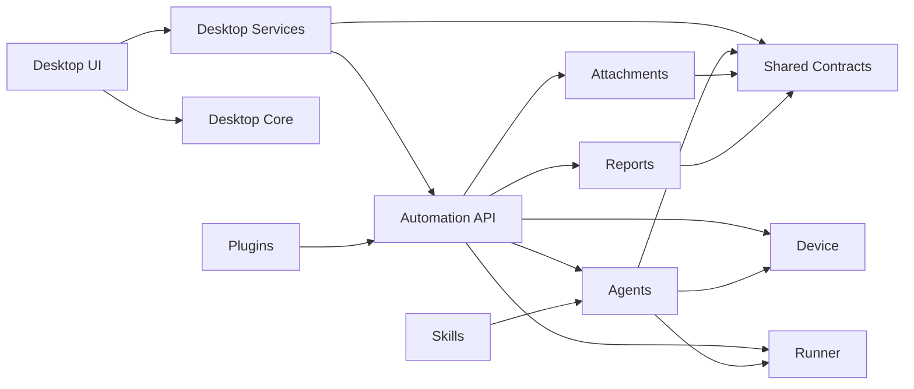

# 项目目录结构

## 1. 设计目标

目录结构围绕以下目标设计：

- 按产品形态和运行进程划分，而不是按技术名词堆放文件。
- Qt 桌面端、Python 自动化服务和共享协议互相独立。
- UI、设备操作、Agent、附件和报告各有清晰所有权。
- 便携运行时、用户任务数据和构建产物不进入源码目录。
- 插件和 Skill 可以独立开发、测试与升级。

## 2. 当前结构

```text
AI_Mobile_Test_Studio_Codex/
  CMakeLists.txt                 # 根构建入口，只负责组合子项目
  README.md                      # 项目入口
  apps/
    desktop/                     # Qt6 桌面应用
      CMakeLists.txt
      README.md
      src/
        app/                     # 程序入口和应用生命周期
          main.cpp
        core/                    # 桌面领域模型和业务规则
        services/                # Bridge、设备、任务等客户端接口
        ui/
          windows/               # 顶层窗口和页面组装
          components/            # Header、Sidebar 等窗口级区域
          pages/                 # 对话、设备控制等主工作区页面
          widgets/               # 可复用、自绘控件
          common/                # UI 基础帮助函数
          styles/                # 应用级 QSS 样式
          forms/                 # 可选 Qt Designer 文件
  services/
    automation/                  # Python 本地自动化服务
      pyproject.toml             # Python 包和依赖入口
      README.md
      src/ai_mobile_test_studio/
        api/                     # Qt 调用的本地 API 和事件流
        agents/                  # Agent 编排与四类 Agent
        attachments/             # 附件解析与结果回填
        device/                  # ADB、Appium、scrcpy、设备观测
        reports/                 # 报告聚合与导出
        runner/                  # 测试脚本执行、重试和取消
        runtime/                 # 内置工具链管理与进程监督
  packages/
    contracts/                   # C++/Python 共享 JSON Schema
      schemas/
  resources/                     # 图片、图标、字体和样式资源
  plugins/                       # 可安装插件
  skills/                        # Agent Skill
  runtime/                       # 打包时装配的便携运行时
  tests/
    cpp/                         # Qt/C++ 测试
    python/                      # Python 测试
  tools/                         # 构建、打包、诊断脚本
  docs/                          # 设计、架构和规范文档
  workspace/                     # 用户任务数据，运行时生成且不入库
  build/                         # CMake 构建目录，不入库
```

## 3. 依赖方向



依赖规则：

1. `ui/` 可以依赖桌面端 `core/` 和 `services/`，反向依赖禁止。
2. Qt UI 不得直接执行 ADB、Appium、scrcpy 或 opencode 命令。
3. Python `api/` 只做参数校验、任务提交和事件输出，不承载复杂业务逻辑。
4. `device/` 只负责设备事实与操作，不理解测试用例或聊天语义。
5. `agents/` 通过受控接口调用设备和 Runner，不直接拼接任意 Shell 命令。
6. `packages/contracts/` 不依赖任何应用模块，是跨语言通信的唯一事实来源。
7. `runtime/` 只存分发期工具链，运行时产生的数据进入 `workspace/`。

## 4. 桌面端放置规则

| 内容 | 目录 |
| --- | --- |
| `main()`、应用初始化 | `apps/desktop/src/app/` |
| 主窗口、设置窗口、报告窗口 | `apps/desktop/src/ui/windows/` |
| Header、Sidebar、DevicePane、ChatPane | `apps/desktop/src/ui/components/` |
| 设备控制等可切换工作区 | `apps/desktop/src/ui/pages/` |
| 手机画面、品牌徽标等可复用控件 | `apps/desktop/src/ui/widgets/` |
| 字体、文本和基础控件帮助函数 | `apps/desktop/src/ui/common/` |
| 应用级 QSS | `apps/desktop/src/ui/styles/` |
| 任务、设备、会话领域模型 | `apps/desktop/src/core/` |
| Bridge、任务和设备客户端 | `apps/desktop/src/services/` |
| 图片、图标和 QSS | `resources/` |

主窗口只保留顶层组合和信号连接；视觉区域放入 `ui/components/`，可复用自绘控件放入 `ui/widgets/`。

桌面端通过 `ScrcpyService` 管理本地 scrcpy 进程。UI 不直接调用 `QProcess`，也不再维护静态手机模拟画面。

设备控制页通过 `AdbControlService` 下发参数化 ADB 命令。KEYCODE 数据集中放在 `core/device_command_catalog.*`，页面不直接维护命令字符串。

## 5. Python 服务放置规则

| 内容 | 目录 |
| --- | --- |
| HTTP、WebSocket、QLocalSocket 入口 | `api/` |
| 脚本生成、UI 理解、错误修复、报告 Agent | `agents/` |
| Excel、CSV、PDF、DOCX、TXT、Markdown | `attachments/` |
| ADB、Appium、截图、Activity、页面树、Toast、Crash、ANR | `device/` |
| Python 测试脚本执行、超时、取消和重试 | `runner/` |
| Markdown 报告及附件结果回填 | `reports/` |
| Python、Node.js、JDK、Appium、scrcpy、opencode 管理 | `runtime/` |

## 6. 命名约定

- 目录和文件使用 `snake_case`。
- C++ 类使用 `PascalCase`。
- Python 包和模块使用 `snake_case`。
- JSON Schema 使用 `kebab-case.schema.json`。
- 插件和 Skill ID 使用稳定的小写 `snake_case`，发布后不随展示名称变化。

## 7. 构建产物边界

以下目录和文件不提交到 Git：

- `build/`
- `.qtcreator/`
- `workspace/`
- Python 虚拟环境和缓存
- `runtime/` 下的第三方二进制

仓库只提交源码、配置、协议、文档和可复现的装配脚本。
