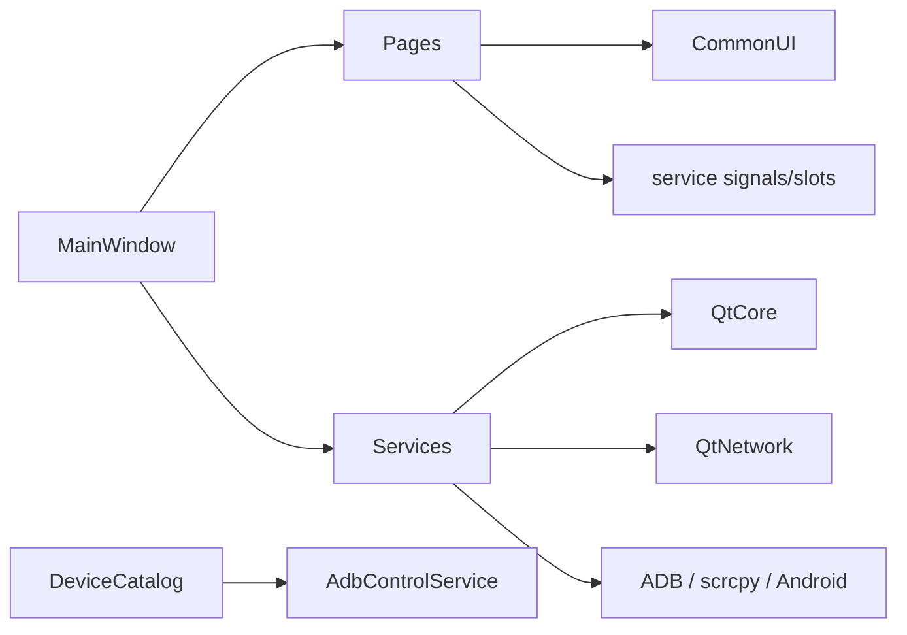
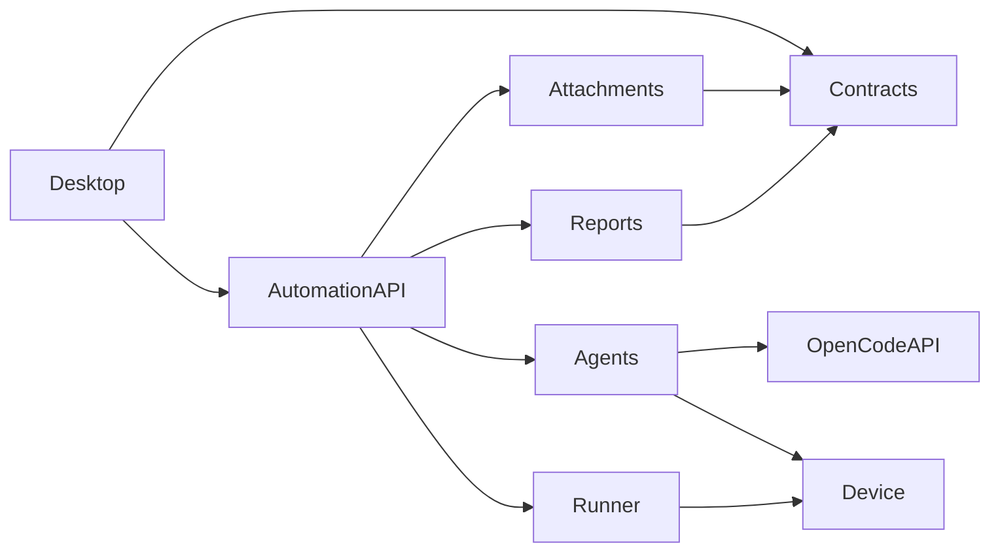

# 项目目录结构

## 1. 说明

本文件描述当前仓库真实结构，并标注未来目录。目录存在不代表功能已经实现。

## 2. 当前结构

```text
AI_Mobile_Test_Studio_Codex/
  CMakeLists.txt
  README.md
  apps/
    desktop/
      CMakeLists.txt
      src/
        app/
          main.cpp
        core/
          device_command_catalog.*
          workspace_catalog.*
        services/
          adb_control_service.*
          automation_artifact_service.*
          adb_shell_session.*
          appium_service.*
          apps_service.*
          file_manager_service.*
          package_manager_service.*
          performance_service.*
          recovery_service.*
          scrcpy_service.*
          conpty_session.*
          display_service.*
          terminal_session.h
          terminal_service.*
          logcat_service.*
          other_service.*
          overview_service.*
          process_service.*
        ui/
          common/                  # Widget helpers、语言、字体与应用偏好
          components/
          motion/                  # 按钮反馈和页面动效基础设施
          pages/
            settings_page.*
            overview_page.*
            display_page.*
            mirroring_page.*
            terminal_page.*
            terminal_bridge.*
            automation_page.*
            device_control_page.*
            package_manager_page.*
            apps_page.*
            files_page.*
            recovery_page.*
            performance_page.*
            layout_page.*
            logcat_page.*
            other_page.*
            process_page.*
          styles/
          widgets/
          windows/
  services/
    automation/                 # Python 包骨架，业务尚未实现
  packages/
    contracts/                  # 协议目录骨架
  resources/
    appium-inspector/           # Appium Inspector 2026.5.1 离线浏览器资源
    font/
      cn/                       # 霞鹜文楷 Regular/Medium
      us/JetBrainsMono-2.304/fonts/ttf/  # JetBrains Mono 全部 32 个 TTF
    images/
    opencode-extension/        # 随包 OpenCode 插件、权限配置和锁定依赖
    terminal-host/conpty_host.js
    terminal-web/              # xterm.js、FitAddon、本地页面和许可证
    tools/java/app_metadata.jar
  runtime/                      # 打包装配目录，二进制被 Git 忽略
  plugins/                      # 早期空目录，非目标模块，可清理
  skills/                       # 早期空目录，非目标模块，可清理
  tests/
    cpp/                        # ConPTY、OpenCode 和 Appium 服务冒烟
  tools/
    android-app-metadata/
    runtime/
      runtime-lock.json         # Windows x64 私有运行时版本、来源、SHA-256 和许可证
      stage-terminal-runtime.ps1 # 完整当前运行时下载、校验、原子 staging 和 manifest 生成
      appium/
        package.json
        package-lock.json       # Appium 与 UiAutomator2 传递依赖锁
  docs/
```

## 3. 当前依赖方向



规则：

1. `main_window.*` 只做顶层创建、连接和工作区切换。
2. 页面不直接创建外部进程或 socket。
3. 设备命令、参数和异步状态归 service 所有。
4. 可复用绘制和终端显示控件放 `ui/widgets/`；页面只负责组合。
5. Android KEYCODE 事实集中在 `core/device_command_catalog.*`。
6. 第三方二进制不提交到普通源码目录。

## 4. 当前运行时输出与目标新增结构

Windows 构建当前会生成并复制以下运行时主体到可执行文件旁；二进制和 npm 依赖不提交 Git：

```text
runtime/
  manifest.json                # schema 2
  android/
    app_metadata.jar
  android-sdk/
    cmdline-tools/latest/
    platform-tools/
  appium/node_modules/
    appium/
    appium-uiautomator2-driver/
  appium-inspector/
  conda/
  fonts/
  images/icons/
  jdk/
  node/
    node.exe
    npm.cmd
    node_modules/node-pty/
  opencode/
  terminal-host/
  terminal-web/
```

以下通用运行时管理、Python、打包和许可证目录仍在后续里程碑实施：

```text
apps/desktop/src/
  runtime/
    runtime_locator.*
    runtime_manager.*
    process_supervisor.*
    port_allocator.*
    runtime_manifest.*
  terminal/
    terminal_session.*
    terminal_session_manager.*
    adb_shell_session.*
    conpty_session.*
    terminal_bridge.*
  clients/
    automation_client.*
    opencode_client.*
  ui/widgets/
    xterm_view.*

tools/
  runtime/
    fetch-runtime.ps1
    verify-runtime.ps1
    stage-runtime.ps1
    generate-notices.ps1
  package/
    package-windows.ps1
    smoke-test-clean-windows.ps1

runtime/
  scrcpy/
  python/

licenses/
  THIRD_PARTY_NOTICES.md
  components/
```

## 5. 用户自动化产物结构

以下目录由 `AutomationArtifactService` 在当前 OpenCode workspace 下创建，不属于安装目录，也不提交到应用仓库：

```text
<workspace>/
  automation/
    scripts/                   # 自动化脚本 HTML 前端
      <feature-or-task>/       # 可按任务继续分层
        index.html
    reports/                   # 文档和测试报告 HTML
      <feature-or-task>/
        index.html
    assets/                    # 可复用 CSS、JavaScript、图片和字体
    runs/                      # 后续执行日志、截图、证据和状态文件
```

桌面端只将 `scripts/` 和 `reports/` 中的 `.html`、`.htm` 显示为可打开产物。扫描结果使用规范化真实路径校验，目录外文件和逃逸符号链接不会进入列表。OpenCode 通过环境变量和 `amts_automation_paths` 获得绝对路径，不需要猜测工作目录。

## 6. Python 自动化服务目标结构

```text
services/automation/
  pyproject.toml
  src/ai_mobile_test_studio/
    api/               # 本机 API 和事件流
    agents/            # Agent 编排
    attachments/       # 用例解析和回填
    device/            # Appium 和设备观测
    reports/           # 报告聚合与导出
    runner/            # 测试执行、超时、取消、重试
    runtime/           # Python 侧运行时适配
```

依赖方向：



## 7. 文件放置表

| 内容 | 目录 |
| --- | --- |
| 应用入口 | `apps/desktop/src/app/` |
| 桌面业务事实和目录 | `apps/desktop/src/core/` |
| 当前设备/文件/应用服务 | `apps/desktop/src/services/` |
| 自动化 HTML 目录监听 | `apps/desktop/src/services/automation_artifact_service.*` |
| 自动化 HTML 工作区 | `apps/desktop/src/ui/pages/automation_page.*` |
| OpenCode 工具插件 | `resources/opencode-extension/` |
| Appium 运行时定位和进程监督 | `apps/desktop/src/services/appium_service.*`（已实现） |
| 通用运行时发现和进程监督 | `apps/desktop/src/runtime/`（规划） |
| 终端会话后端 | `apps/desktop/src/terminal/`（规划） |
| 主工作区页面 | `apps/desktop/src/ui/pages/` |
| 复用控件和 xterm 宿主 | `apps/desktop/src/ui/widgets/` |
| 应用级样式 | `apps/desktop/src/ui/styles/` |
| 跨进程 JSON Schema | `packages/contracts/schemas/` |
| 可复现运行时装配脚本 | `tools/runtime/`（当前 Windows x64 私有 runtime 已实现，Python/scrcpy 与 notices 仍规划中） |
| 发布打包脚本 | `tools/package/`（规划） |
| 随包第三方许可证 | `licenses/`（规划） |
| 用户任务产物 | workspace，不进入安装目录和 Git |

## 8. 运行时与用户数据边界

- `runtime/`：只读、随发布制品装配的工具和静态资源。
- `resources/`：源码内资源和可复现构建的小型自有工具。
- `build*/`：本机构建输出。
- workspace：用户项目、测试任务和 `automation/` HTML 产物。
- `QStandardPaths` 用户目录：设置、缓存、凭据、会话和日志。

运行时不得把缓存写回安装目录。详细规则见 [PORTABLE_RUNTIME.md](PORTABLE_RUNTIME.md)。

## 9. 命名约定

- C++ 文件和目录：`snake_case`。
- C++ 类型：`PascalCase`；成员：`m_` 前缀。
- Python 包和模块：`snake_case`。
- JSON Schema：`kebab-case.schema.json`。
- runtime component ID：使用稳定小写 ID，发布后不因展示名称变化。

项目不新增自有 Plugin/Skill 目录协议。OpenCode 扩展放在 OpenCode 支持的标准用户或 workspace 配置位置，并由 OpenCode 自己加载。

## 10. Git 边界

默认不提交：

- `build/`、`build-*`、Qt Creator 本地配置。
- workspace 和任务产物。
- runtime 下的大型第三方二进制。
- Python 缓存和虚拟环境。
- 用户配置、凭据和诊断日志。

必须提交：

- 运行时锁文件、校验值和装配脚本。
- 第三方许可证模板和生成规则。
- 协议 Schema、测试、源码和文档。
