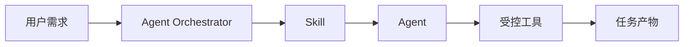

# Skill 规范

## 1. Skill 定位

Skill 是面向 Agent 的能力包，用来描述某类测试任务的知识、流程、提示词、工具约束和产物格式。插件偏工程扩展，Skill 偏 Agent 行为约束。

本项目中的 Skill 不是让用户手写复杂脚本，而是让脚本生成、UI 理解、错误修复和测试报告 Agent 能按统一规则完成工作。

## 2. Skill 与 Agent 的关系



一个 Agent 可以加载多个 Skill，一个 Skill 也可以被多个 Agent 使用。

示例：

- `doubao_glasses_bluetooth.skill`
- `wifi_connection_test.skill`
- `android_ui_recovery.skill`
- `markdown_report.skill`

## 3. Skill 目录结构

```text
skills/
  doubao_glasses_bluetooth/
    skill.json
    README.md
    prompts/
      script_generation.md
      ui_understanding.md
      error_fix.md
      report.md
    templates/
      appium_test.py.j2
      report.md.j2
    examples/
      cases.xlsx
      report.md
```

## 4. Skill 清单

每个 Skill 必须包含 `skill.json`。

```json
{
  "id": "doubao_glasses_bluetooth",
  "name": "豆包眼镜蓝牙连接测试",
  "version": "0.1.0",
  "description": "指导 Agent 生成、执行和修复豆包 App 与眼镜蓝牙连接测试。",
  "agentTypes": [
    "script_generation",
    "ui_understanding",
    "error_fix",
    "report"
  ],
  "inputs": [
    "user_message",
    "attachments",
    "device_context",
    "page_source",
    "screenshots",
    "logs"
  ],
  "outputs": [
    "test_plan",
    "python_script",
    "fix_patch",
    "markdown_report",
    "filled_attachment"
  ],
  "tools": [
    "device.take_screenshot",
    "device.get_page_source",
    "device.get_current_activity",
    "runner.run_python_test",
    "artifact.write_file"
  ],
  "compatibleWith": {
    "app": ">=0.1.0",
    "skillApi": "1"
  }
}
```

## 5. Agent 类型

| 类型 | ID | 主要职责 |
| --- | --- | --- |
| 脚本生成 | `script_generation` | 生成 Appium 自动化脚本 |
| UI 理解 | `ui_understanding` | 识别页面、控件、弹窗、状态 |
| 错误修复 | `error_fix` | 根据失败上下文修改脚本 |
| 测试报告 | `report` | 生成报告并回填附件 |

## 6. Prompt 文件规范

Prompt 文件必须包含：

- 角色说明。
- 输入字段。
- 可调用工具。
- 禁止事项。
- 输出格式。
- 失败处理。

示例：

```markdown
# 脚本生成 Prompt

你是移动端自动化测试脚本生成 Agent。

## 输入

- 用户需求
- 测试用例
- 当前 Activity
- 页面树
- 截图说明

## 约束

- 使用 Python + Appium。
- 优先使用稳定控件定位。
- 不要编造页面元素。
- 不要直接使用坐标，除非没有可用控件定位。

## 输出

返回 JSON，包含 test_plan、files、warnings。
```

## 7. Skill 输出格式

Agent 输出必须结构化，便于 UI 展示和后续自动处理。

```json
{
  "ok": true,
  "agentType": "script_generation",
  "summary": "已生成蓝牙连接测试脚本",
  "artifacts": [
    {
      "type": "python_script",
      "path": "scripts/test_bt_connect.py"
    }
  ],
  "nextActions": [
    "run_test"
  ],
  "warnings": []
}
```

失败输出：

```json
{
  "ok": false,
  "agentType": "error_fix",
  "summary": "无法修复控件定位失败",
  "reason": "页面树中不存在目标控件，且截图显示当前页面未进入设备连接页。",
  "requiredUserAction": "请确认豆包 App 是否登录并进入首页。"
}
```

## 8. Tool 调用边界

Skill 只能声明 Agent 可用工具，不直接执行工具。

工具调用必须经过 Agent Orchestrator：

- 检查权限。
- 记录日志。
- 限制路径。
- 限制超时。
- 记录结果。

禁止 Skill 要求 Agent 直接执行任意系统命令。

## 9. 设备上下文字段

Skill 可以使用以下设备上下文：

```json
{
  "device": {
    "id": "R5CT0000000",
    "brand": "Samsung",
    "androidVersion": "14",
    "screenSize": "1080x2400"
  },
  "app": {
    "package": "com.example.doubao",
    "activity": ".MainActivity",
    "fragment": "DeviceConnectFragment"
  },
  "ui": {
    "screenshot": "screenshots/current.png",
    "pageSource": "runs/current_page.xml",
    "clickableElements": []
  },
  "runtime": {
    "toast": null,
    "crash": null,
    "anr": null,
    "logcat": "logs/logcat.txt"
  }
}
```

## 10. 回填规范

报告 Skill 需要输出可回填结果：

```json
{
  "caseResults": [
    {
      "caseId": "BT-001",
      "status": "passed",
      "elapsedMs": 2380,
      "actual": "页面显示已连接",
      "evidence": ["screenshots/BT-001-pass.png"],
      "failureReason": null,
      "suggestion": null
    }
  ]
}
```

回填模块再根据原附件格式写回：

- Excel：新增或更新“执行结果、实际结果、失败原因、截图、耗时、建议”列。
- Markdown：追加结果表格。
- Word：追加测试结果章节。
- PDF：不直接改原文件，生成旁路 Markdown 或 Word 报告。

## 11. Skill 质量要求

一个 Skill 合格标准：

- 输入输出字段明确。
- 不依赖未声明工具。
- 不要求 Agent 编造设备状态。
- 有失败处理策略。
- 有示例用例和示例报告。
- 能被禁用或升级。

