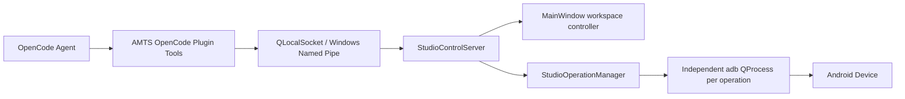

# Studio Control API

## 1. 状态与目标

**状态：已实现。**

Studio Control API 是专门提供给应用内 OpenCode 终端的本地控制接口。它允许 OpenCode 插件：

- 读取 Studio、当前工作区和设备连接状态。
- 通过稳定字符串 ID 打开侧边栏主工作区。
- 异步读取设备概览和应用包列表。
- 执行经过 Studio 白名单校验的安全设备动作。
- 查询或取消异步操作。

该接口不等同于 OpenCode Server/SDK。当前方向是 `OpenCode -> Studio`；未来 Qt 通过 OpenCode Server/SDK 创建会话和读取 Agent 事件属于独立的 `Studio -> OpenCode` 通道。

## 2. 组件与数据流



源码位置：

- `apps/desktop/src/core/workspace_catalog.*`
- `apps/desktop/src/services/studio_control_protocol.*`
- `apps/desktop/src/services/studio_control_server.*`
- `apps/desktop/src/services/studio_operation_manager.*`
- `resources/opencode-extension/plugins/ai-mobile-test-studio.ts`

## 3. 传输与认证

Windows 使用 Qt `QLocalServer`，底层为当前用户可访问的命名管道。每次应用启动都会生成新的管道名和 256 位随机 Token，并只注入该应用创建的 OpenCode ConPTY 子进程：

```text
AI_MOBILE_TEST_STUDIO_CONTROL_PIPE
AI_MOBILE_TEST_STUDIO_CONTROL_TOKEN
AI_MOBILE_TEST_STUDIO_CONTROL_PROTOCOL=1
OPENCODE_CONFIG_DIR=<application>/runtime/opencode-extension
```

Token 不写入配置文件、日志或命令行。服务端使用 `QLocalServer::UserAccessOption`，最多接受 8 个并发本地客户端。

消息使用 JSON-RPC 2.0。每帧为：

```text
4-byte little-endian payload length
UTF-8 JSON object
```

单帧最大 1 MiB。每个请求的 `params.token` 必须匹配本次应用运行生成的 Token。

## 4. 稳定工作区 ID

插件和外部调用不得依赖 `QStackedWidget` 数字索引。当前稳定 ID 为：

```text
overview
display
mirroring
terminal
automation
device-control
packages
apps
files
recovery
performance
layout
logcat
other
process
settings
```

数字索引只保留在 `workspace_catalog.*` 内部映射中。

## 5. JSON-RPC 方法

| 方法 | 类型 | 说明 |
| --- | --- | --- |
| `studio.hello` | 即时 | 返回协议版本和能力列表 |
| `studio.status` | 即时 | 返回当前工作区、设备状态和能力列表 |
| `workspace.list` | 即时 | 返回稳定工作区目录 |
| `workspace.open` | 即时 UI 动作 | 打开 `workspaceId` 对应主工作区 |
| `device.refresh` | 即时 UI 动作 | 请求 `ScrcpyService` 重新探测设备 |
| `device.snapshot` | 异步 | 读取设备属性、版本、显示、电池、内存和运行时间 |
| `device.apps.list` | 异步 | 读取设备软件包和 APK 路径 |
| `device.action` | 异步 | 执行安全动作白名单 |
| `operation.get` | 即时 | 查询操作状态和结果 |
| `operation.cancel` | 即时 | 取消运行中的操作 |

异步方法立即返回：

```json
{
  "operationId": "op_...",
  "status": "running"
}
```

终态为 `completed`、`failed` 或 `canceled`。操作记录在当前应用进程内最多保留 256 条。

## 6. 安全动作白名单

首版 `device.action` 只允许：

| action | 参数 | 实际能力 |
| --- | --- | --- |
| `keyEvent` | `keyCode` | 只接受 `KEYCODE_[A-Z0-9_]+` |
| `launchApp` | `packageName` | 使用 Launcher category 启动应用 |
| `stopApp` | `packageName` | 使用 `am force-stop` 停止应用 |

首版明确不开放任意 Shell、重启、关机、卸载、清数据、文件删除、Recovery 或 scrcpy 生命周期控制。未来增加这些能力时必须由 Studio 宿主执行二次确认，不能只依赖 OpenCode 的 `permission: "ask"`。

## 7. 并发与 UI 隔离

API 不复用页面 service 中的单例 `QProcess`。每个设备查询或动作都创建独立 ADB 子进程，因此 OpenCode 执行任务时：

- Qt 主线程只解析请求、切换工作区和更新轻量状态，不等待 ADB I/O。
- 用户可继续使用概览、应用、文件、进程等其它工作区。
- 页面 service 的输出缓存、当前请求类型和信号不会被 OpenCode 操作覆盖。
- `device.snapshot` 和 `device.apps.list` 可以并行执行。
- 同一设备上的 OpenCode 控制动作使用 `device:<serial>:control` 资源锁串行化。

当前白名单动作与页面读取可以同时进行。会修改设备连接、文件系统或镜像进程的能力尚未开放，避免出现需要跨 UI service 的共享资源锁。

## 8. OpenCode 工具

随包插件注册：

| 工具 | 默认权限 | 映射 |
| --- | --- | --- |
| `amts_status` | allow | `studio.status` |
| `amts_workspace_open` | allow | `workspace.open` |
| `amts_automation_paths` | allow | 返回自动化 HTML 产物目录和交付约束 |
| `amts_device_refresh` | allow | `device.refresh` |
| `amts_device_read` | allow | 设备快照或应用列表，可自动等待终态 |
| `amts_safe_action` | ask | 安全动作白名单，可自动等待终态 |
| `amts_operation_get` | allow | `operation.get` |
| `amts_operation_cancel` | allow | `operation.cancel` |

插件只做环境读取、命名管道连接、协议封装和结果轮询，不直接运行 `adb.exe`。

### HTML 产物目录

主窗口为应用内 OpenCode 注入以下进程级环境变量：

```text
AI_MOBILE_TEST_STUDIO_AUTOMATION_ROOT
AI_MOBILE_TEST_STUDIO_AUTOMATION_SCRIPTS
AI_MOBILE_TEST_STUDIO_AUTOMATION_REPORTS
AI_MOBILE_TEST_STUDIO_AUTOMATION_ASSETS
AI_MOBILE_TEST_STUDIO_AUTOMATION_RUNS
```

`amts_automation_paths` 根据任务类型返回建议输出目录。自动化脚本的最终 HTML 写入 `scripts`，文档和测试报告写入 `reports`；入口文件必须无需额外构建即可由默认浏览器直接打开。HTML 可以引用 `assets` 中的共享资源，执行日志、截图和证据预留给 `runs`。

## 9. 构建与测试

插件依赖由 `resources/opencode-extension/package-lock.json` 锁定。`tools/runtime/stage-opencode-extension.ps1` 在构建阶段执行 `npm ci` 并把完整依赖树 staging 到构建目录；应用启动阶段不联网安装插件。

自动化测试：

- `studio_control_server_smoke`：分帧、认证、工作区枚举和打开。
- `studio_operation_manager_smoke`：并行只读操作、结果解析、控制动作资源锁和取消。
- `automation_artifact_service_smoke`：目录创建、脚本/报告 HTML 扫描、分类和非产物目录过滤。
- OpenCode `debug config`：验证随包插件路径和权限配置可被 OpenCode 1.18.5 加载。

真机发布验收仍需覆盖设备断开、切换、unauthorized、长应用列表、动作失败和应用退出时操作取消。
