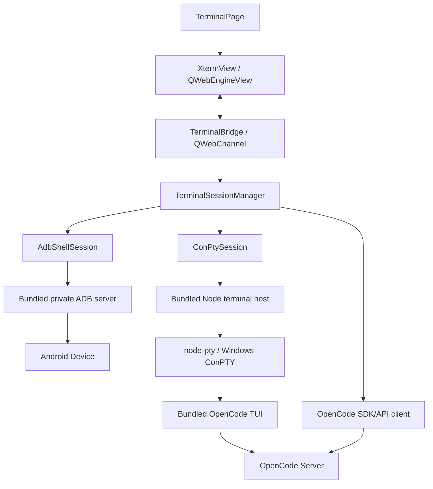

# 终端与 OpenCode 集成架构

## 1. 决策摘要

项目采用统一终端视图、多个会话后端的设计：

- 当前 ADB 会话层继续负责 Android 设备终端。
- 显示层迁移到 xterm.js，以完整支持 OpenCode、`vim`、全屏 TUI、备用屏幕、鼠标协议、IME 和复杂 ANSI 序列。
- Windows 本地 OpenCode 由随包 `node-pty` 创建 ConPTY；Qt 与终端宿主之间的 `QProcess` 只传输带帧输入和原始输出，不把普通管道伪装成 TTY。
- Qt 使用 `QWebEngineView` 承载本地 xterm.js 页面，并通过 `QWebChannel` 与 C++ 通信。
- 产品级 AI 自动化同时使用 OpenCode Server/SDK 获取结构化状态，禁止解析终端文字来判断任务结果。

QTermWidget 不作为 Windows 方案：其官方兼容列表为 BSD、Linux 和 macOS，且整体许可证为 GPLv2+。

## 2. 当前实现

当前代码位于：

- `apps/desktop/src/services/terminal_service.*`
- `apps/desktop/src/services/terminal_session.h`
- `apps/desktop/src/services/adb_shell_session.*`
- `apps/desktop/src/services/conpty_session.*`
- `apps/desktop/src/ui/pages/terminal_page.*`
- `apps/desktop/src/ui/pages/terminal_bridge.*`
- `resources/terminal-host/conpty_host.js`
- `resources/terminal-web/`

已经实现：

- 直接连接本机 ADB server。
- 选择指定设备 transport。
- 优先使用 `shell,v2:`，失败时回退 `shell:`。
- 多个独立 shell 会话。
- stdin、stdout、stderr 和窗口行列同步。
- 设备断开、切换、会话重启和退出处理。
- 多标签、键盘输入、复制粘贴、清空、重置和快捷命令。
- 统一 `TerminalSession` 契约和 `adb-shell` / `opencode` 会话路由。
- Windows Terminal 风格的“+”新建菜单，ADB 与 OpenCode 标签独立编号；不再保留重复的下拉选择按钮。
- OpenCode 会话不随 Android 设备断开或切换而终止。
- `node-pty` ConPTY 宿主的输入、输出、resize 和退出帧协议，并有自动化冒烟测试。
- 本地 xterm.js 6.0.0、FitAddon 0.11.0、QWebChannel 桥接、CSP 和复制粘贴逻辑。
- xterm.js 写入完成回执和真实背压：C++ 每次最多投递 32KB，收到 `term.write()` 回调后再以 8ms 间隔发送下一块，待处理缓冲上限为 4MB。
- ConPTY 宿主按 8ms/64KB 合并 PTY 输出；普通隐藏标签暂停向 WebView 投递，启动时创建的默认 OpenCode 标签保持后台投递以完成预渲染。
- 终端始终使用随包 JetBrains Mono 作为等宽主字体，中文模式追加随包霞鹜文楷作为 CJK 回退；字体就绪后重新执行 `FitAddon.fit()`。
- ASCII 可打印输入在 xterm.js 侧按 4ms 窗口有序合并后进入 WebChannel；中文、emoji 等 Unicode 的 IME 提交以及控制字符和 Escape 序列即时发送，避免 WebEngine 主线程繁忙时延迟展示已提交文字。
- Qt WebEngine 可用时启用 xterm.js；缺少 WebEngine 依赖的工具链保留基础 ANSI/CSI 降级显示。
- 锁定 OpenCode 1.18.5、Node.js 24.18.0 和 `node-pty` 1.1.0；Windows 构建默认下载、校验、staging，并自动注册 ConPTY 冒烟测试。
- 已使用真实 `opencode.exe` 通过 `node-pty`/ConPTY 完成版本启动冒烟。

当前限制：

- 二进制仍不提交到 Git；首次 Windows 构建需要网络获取锁定归档，之后复用构建目录缓存，也可显式提供三个本地 runtime 覆盖。
- 当前 Qt WebEngine 构建已经跑通 ConPTY 手动回显和随包 OpenCode 1.18.5 启动，并已优化中文 IME 提交链路；不同输入法、鼠标、备用屏幕和长时间高输出仍需完成发布级兼容性矩阵。
- `QPlainTextEdit` 降级显示不保证备用屏幕、鼠标、复杂 Unicode 宽度和样式正确；正式 OpenCode TUI 必须使用 WebEngine/xterm.js 构建。
- OpenCode Server/SDK、会话认证和结构化 Agent 状态仍未接入。

## 3. 目标架构



显示层只理解终端字节和会话状态，不关心会话来自 Android、OpenCode、PowerShell 或测试 Runner。

## 4. 统一会话契约

当前已经定义独立接口，不让页面直接依赖 ADB 或 ConPTY：

```cpp
class TerminalSession : public QObject
{
    Q_OBJECT
public:
    virtual void start() = 0;
    virtual void write(const QByteArray &data) = 0;
    virtual void resize(int columns, int rows) = 0;
    virtual void stop() = 0;

signals:
    void started();
    void outputReady(const QByteArray &data);
    void exited(bool wasStarted, const QString &reason);
};
```

会话描述建议包含：

```json
{
  "id": "stable-session-id",
  "kind": "adb-shell | opencode | local-shell",
  "title": "OpenCode - mobile-tests",
  "workingDirectory": "D:/work/mobile-tests",
  "deviceSerial": null,
  "columns": 120,
  "rows": 36
}
```

## 5. xterm.js 显示层

当前已经随源码提供：

- `@xterm/xterm` 6.0.0
- `@xterm/addon-fit` 0.11.0

后续按需求增加：

- `@xterm/addon-webgl`
- `@xterm/addon-unicode11`
- `@xterm/addon-search`
- `@xterm/addon-clipboard`

规则：

- 所有资源构建后放入 `runtime/terminal-web/`，运行时不访问 CDN。
- WebGL 初始化失败时回退到 xterm.js 内置渲染器。
- `FitAddon.fit()` 后必须把 `cols/rows` 回传后端。
- `term.onData()` 保持输入内容与顺序，不进行 Shell 转义或换行改写；仅 ASCII 可打印文本允许在最多 4ms 的窗口内合并，Unicode/IME 提交与控制输入必须即时发送。
- 后端输出作为终端数据写入 `term.write()`，不能先剥离 ANSI。
- 页面只允许加载本地资源；关闭外部导航、下载和不需要的浏览器能力。
- 主题、字体和缩放由桌面设置统一下发。

Qt 集成：

- `QWebEngineView` 作为普通 QWidget 放入终端页。
- `QWebChannel` 暴露最小 `write`、`resize`、`copy`、`paste`、`focus` 和 session 控制接口。
- QWebChannel 使用 Base64 承载原始终端字节；每次只允许一个 xterm 写入在途，前端回调 `outputConsumed()` 后才能继续投递。
- 每个标签使用独立 `TerminalView`；普通后台标签只保留有上限的 C++ 缓冲，启动预热的默认 OpenCode 标签保持投递，避免首次进入时集中回放。

## 6. ADB 后端

保留现有 `shell,v2` 数据模型，并迁移到统一接口：

- stdin packet id `0`
- stdout packet id `1`
- stderr packet id `2`
- exit packet id `3`
- window size packet id `5`

ADB server host 和端口必须来自 `RuntimeManager`，不能默认假设系统 `5037`。设备切换时关闭旧 transport，并为仍存在的标签创建新会话。

## 7. Windows ConPTY 后端

OpenCode TUI 需要真正的 Windows pseudo console：

1. Qt 使用绝对路径启动随包 Node.js 和 `resources/terminal-host/conpty_host.js`。
2. 宿主通过经过生产验证的 `node-pty` 原生模块创建 Windows ConPTY 并启动随包 OpenCode。
3. Qt 到宿主的 stdin 使用 `type + uint32 little-endian length + payload` 帧；输入、resize 和停止分别使用 `i`、`r`、`x` 类型。
4. 宿主 stdout 只承载原始终端字节，stderr 只承载 `READY` 和 Base64 错误控制消息。
5. 宿主在 8ms 窗口内合并 PTY 输出，每批最多 64KB，减少进程间消息数量。
6. xterm.js 输入不经 Shell 转义，resize 以字符列/行发送给 `node-pty`。
7. 标签关闭或应用退出时终止宿主；宿主关闭 PTY，避免残留 OpenCode/ConPTY 进程。

不得直接用普通 `QProcess` 的 stdout/stdin 启动 OpenCode。当前 `QProcess` 的子进程是终端宿主，真正的 OpenCode 子进程始终由 `node-pty` 放入 ConPTY。

开发构建路径覆盖：

- `AI_MOBILE_TEST_OPENCODE_PATH`
- `AI_MOBILE_TEST_WORKSPACE`
- `AI_MOBILE_TEST_NODE_PATH`
- `AI_MOBILE_TEST_NODE_PTY_PATH`

CMake staging 参数：

- `AI_MOBILE_TEST_OPENCODE_EXECUTABLE`
- `AI_MOBILE_TEST_NODE_EXECUTABLE`
- `AI_MOBILE_TEST_NODE_PTY_MODULE`
- `AI_MOBILE_TEST_STAGE_TERMINAL_RUNTIME`：Windows 默认开启；关闭后必须通过上述三个参数或运行时环境变量提供依赖。

跨平台扩展时：

- Windows：ConPTY
- Linux/macOS：`forkpty`/`openpty`
- UI 和会话管理层保持不变

## 8. OpenCode 集成

### 8.1 TUI 会话

- 使用随包 OpenCode 的绝对路径。
- `cwd` 设置为用户选中的自动化测试项目目录。
- 终端类型使用兼容 xterm 的环境配置。
- 标签关闭时执行可控退出；强制终止前给进程有限清理时间。
- OpenCode 的配置、缓存、会话和凭据进入用户数据目录。

### 8.2 Server/SDK

OpenCode 官方架构中，TUI 是 Server 的客户端；Server 暴露 OpenAPI 3.1 和 SDK。项目应利用这一结构：

- TUI 负责专家用户可见的完整交互。
- Server/SDK 负责会话列表、消息、权限、任务状态和结构化结果。
- `/tui` 接口可用于预填或运行提示词。
- Server 绑定 `127.0.0.1` 动态端口，并设置随机密码。
- 自动化流程不得通过 OCR、正则或终端屏幕文本判断 OpenCode 是否完成。

推荐产品交互：

1. 用户在测试工作区选择“交给 AI”。
2. 应用通过 Server/SDK 创建或选择会话并提交结构化上下文。
3. OpenCode TUI 标签自动切换到对应 workspace，供用户观察和干预。
4. 应用通过 API 事件更新任务页、权限提示和测试状态。
5. 生成的脚本、补丁和报告写入任务产物目录。

## 9. 安全边界

- 终端默认工作目录必须明确可见。
- OpenCode 的文件访问和命令权限遵守 workspace 范围和项目权限策略。
- ADB 快捷命令中重启、卸载、清数据等破坏性动作必须确认。
- 不记录粘贴的密钥和认证内容。
- WebEngine 禁止加载任意远程脚本，内容安全策略只允许随包资源。
- OpenCode Server 不监听 `0.0.0.0`，除非未来有明确的受认证远程协作设计。

## 10. 迁移顺序

1. **已完成**：抽取 `TerminalSession`，ADB 后端通过统一接口运行。
2. **已完成**：新增本地 xterm.js、QWebChannel 输入输出和 resize 闭环。
3. **已完成**：实现 `node-pty` ConPTY 宿主，并用真实帮助进程验证输入、输出、resize 和退出。
4. **部分完成**：已锁定并在 Windows 开发构建中装配 Node.js、`node-pty` 和 OpenCode；完整发布包的 Qt WebEngine 依赖和许可证产物仍在进行中。
5. **部分完成**：Qt WebEngine 构建已通过 ConPTY 回显和 OpenCode 1.18.5 基本交互链路；继续完成 `vim`、IME、鼠标、备用屏幕和长时间高输出验收。
6. **待开始**：接入 `RuntimeLocator`、manifest 校验和启动自检。
7. **待开始**：接入 OpenCode Server/SDK，停止解析终端文字。
8. **待开始**：加入搜索、链接、Unicode11、WebGL、可访问性和性能测试，随后删除降级解析器。

## 11. 验收矩阵

| 场景 | 预期 |
| --- | --- |
| ADB 普通 shell | 命令、颜色、Ctrl+C、历史和 resize 正常 |
| 两个设备终端标签 | 输出互不串流，关闭一个不影响另一个 |
| OpenCode TUI | 布局、命令面板、鼠标、滚动和中文输入正常 |
| `vim`/全屏 TUI | 进入和退出备用屏幕后原滚动区恢复 |
| 高 DPI 和窗口缩放 | 字符网格稳定，无内容遮挡 |
| 大量输出 | UI 不阻塞，内存有上限，滚动仍可操作 |
| 设备断开 | ADB 会话明确结束，OpenCode 会话不受影响 |
| 应用退出 | ConPTY、ADB socket、OpenCode Server 和子进程全部回收 |

## 12. 参考资料

- [xterm.js 官方仓库](https://github.com/xtermjs/xterm.js)
- [QWebEngineView](https://doc.qt.io/qt-6/qwebengineview.html)
- [QWebChannel](https://doc.qt.io/qt-6/qwebchannel.html)
- [Windows ConPTY](https://learn.microsoft.com/en-us/windows/console/creating-a-pseudoconsole-session)
- [node-pty 官方仓库](https://github.com/microsoft/node-pty)
- [OpenCode TUI](https://opencode.ai/docs/tui/)
- [OpenCode Server](https://opencode.ai/docs/server/)
- [OpenCode SDK](https://opencode.ai/docs/sdk/)
- [QTermWidget 官方仓库](https://github.com/lxqt/qtermwidget)
